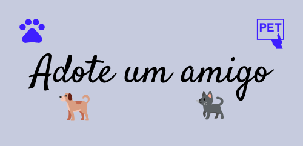

  
  
  
  

    

## 📄 Descrição

Adote um amigo é um site com a finalidade de encontrar lares para animais abandonados ou simplesmente sem donos, o grande objetivo real é juntar pessoas que querem adotar um animal com pessoas que têm esse animal e querem encontrar um lar para ele

    

## 🚧 Telas
- Tela inicial com listagem de animais para adoção
  - [x] Filtrar por tipo de pet
  - [x] Ordenar pelos mais antigos / mais novos
  - [x] Pesquisar por cidade

- Tela de Pet
  - [x] Foto do pet e dados sobre o mesmo
  - [x] Possibilitar criação de comentários
  - [x] Invalidar comentários de quem não estiver logado
  - [x] Link para whatsapp

- Tela de criar publicaçao
  - [x] Possibilitar a criação de uma publicação 

- Tela de Pets favoritados
  - [ ] Todos os pets favoritados 

- Login e cadastro
  - [x] Tela simples de login e cadasto
  - [x] Sistema de autenticação
